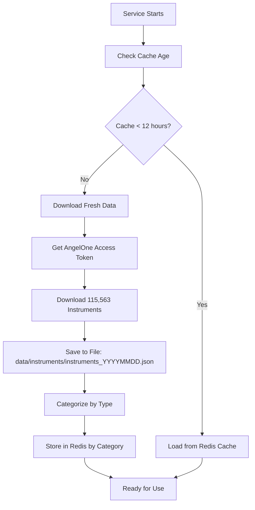

# AngelOne Integration Flow - Complete Guide

## 🎯 Overview

This document explains the complete flow of how the `categorized_redis_market_data` service integrates with AngelOne for both **instrument management** and **real-time market data access** for trading strategies.

## 🔄 **Part 1: Instrument Download & Management**

### 1.1 When Does Download Happen?

```python
# Automatic daily download at 9:00 AM IST
schedule.every().day.at("09:00").do(download_and_categorize)

# Also downloads on first initialization if cache is older than 12 hours
if datetime.now() - last_update > timedelta(hours=12):
    await self.download_and_categorize()
```

### 1.2 What Exactly Gets Downloaded?

**Source**: AngelOne API Endpoint
```
https://margincalculator.angelbroking.com/OpenAPI_File/files/OpenAPIScripMaster.json
```

**Raw Data Structure** (per instrument):
```json
{
  "token": "1594",
  "symbol": "INFY-EQ", 
  "name": "Infosys Ltd",
  "expiry": "",
  "strike": "0.00",
  "lotsize": "1",
  "instrumenttype": "EQUITY",
  "exch_seg": "NSE",
  "tick_size": "0.05"
}
```

### 1.3 Complete Download Flow



### 1.4 How Categorization Works

```python
# Raw instrument types from AngelOne
CATEGORIES = {
    'EQUITY': ['EQUITY'],                                    # 17,924 stocks
    'OPTIONS': ['OPTSTK', 'OPTIDX', 'OPTCUR', 'OPTFUT'],   # 95,043 options
    'FUTURES': ['FUTSTK', 'FUTIDX', 'FUTCOM', 'FUTCUR'],   # 1,825 futures
    'COMMODITY': ['COMDTY'],                                 # 554 commodities
    'CURRENCY': ['UNDCUR', 'UNDIRC', 'UNDIRD', 'UNDIRT'],  # 93 currencies
    'INDEX': ['INDEX', 'AMXIDX']                            # 124 indices
}

# Result: Redis storage by category
instruments:category:equity    # NSE & BSE stocks
instruments:category:options   # All option contracts
instruments:category:futures   # All future contracts
instruments:category:commodity # MCX & NCDEX commodities
instruments:category:currency  # CDS currency instruments  
instruments:category:index     # Index instruments
```

## 📊 **Part 2: Using Instruments for Real-Time Data**

### 2.1 Getting Instrument Tokens for Subscription

```python
# Example: Get NIFTY options for live data subscription
from app.services.categorized_redis_market_data import create_categorized_service

service = await create_categorized_service(broker_config)

# Search for specific instruments
nifty_options = await service.search_instruments('NIFTY', category='OPTIONS', limit=10)

# Extract tokens for subscription
tokens_to_subscribe = [instrument['token'] for instrument in nifty_options]
print(f"Tokens: {tokens_to_subscribe}")
# Output: ['12345', '12346', '12347', ...]

# Get specific instrument details
for instrument in nifty_options:
    print(f"Symbol: {instrument['symbol']}")
    print(f"Token: {instrument['token']}")
    print(f"Exchange: {instrument['exchange']}")
    print(f"Strike: {instrument.get('strike', 'N/A')}")
```

### 2.2 Real-Time Data Subscription Flow

```python
# Step 1: Get instruments you want to track
equity_stocks = await service.search_instruments('BANK', category='EQUITY', exchange='NSE')
bank_tokens = [stock['token'] for stock in equity_stocks]

# Step 2: Subscribe to AngelOne WebSocket for live data
import websockets
import json

async def subscribe_to_live_data(tokens_list, access_token):
    """Subscribe to live market data from AngelOne"""
    
    # AngelOne WebSocket URL
    ws_url = "wss://omnefeeds.angelbroking.com/NestHtml5Mobile/socket.io/"
    
    async with websockets.connect(ws_url) as websocket:
        # Authenticate
        auth_message = {
            "correlationID": "unique_id",
            "action": 1,
            "params": {
                "mode": 1,
                "tokenList": [
                    {"exchangeType": 1, "tokens": tokens_list}
                ]
            }
        }
        
        await websocket.send(json.dumps(auth_message))
        
        # Listen for data
        async for message in websocket:
            data = json.loads(message)
            # Process real-time data
            await process_market_data(data)

async def process_market_data(data):
    """Process incoming market data"""
    token = data.get('token')
    ltp = data.get('ltp')  # Last Traded Price
    volume = data.get('volume')
    
    # Store in Redis for strategies to access
    await redis_client.set(f"live_data:{token}", json.dumps({
        'ltp': ltp,
        'volume': volume,
        'timestamp': datetime.now().isoformat()
    }))
```

## 🚀 **Part 3: Strategy Integration**

### 3.1 How Strategies Access Instrument Data

```python
# In your trading strategy
class BankNiftyOptionsStrategy:
    
    async def initialize(self):
        """Initialize strategy with required instruments"""
        
        # Get the market data service
        self.market_service = await create_categorized_service(broker_config)
        
        # Find Bank Nifty options expiring this month
        bank_nifty_options = await self.market_service.search_instruments(
            'BANKNIFTY', 
            category='OPTIONS', 
            exchange='NFO',
            limit=50
        )
        
        # Filter for specific strikes and expiry
        self.target_instruments = self.filter_instruments(bank_nifty_options)
        
        # Subscribe to live data for these instruments
        self.tokens = [inst['token'] for inst in self.target_instruments]
        await self.subscribe_to_live_data(self.tokens)
    
    def filter_instruments(self, options_list):
        """Filter options by criteria"""
        filtered = []
        for option in options_list:
            # Example: Only ATM and nearby strikes
            if 'CE' in option['symbol'] or 'PE' in option['symbol']:
                filtered.append(option)
        return filtered
    
    async def get_current_price(self, token):
        """Get current price for an instrument"""
        live_data = await redis_client.get(f"live_data:{token}")
        if live_data:
            data = json.loads(live_data)
            return data['ltp']
        return None
    
    async def execute_strategy(self):
        """Main strategy execution"""
        for instrument in self.target_instruments:
            token = instrument['token']
            current_price = await self.get_current_price(token)
            
            if current_price:
                # Apply your strategy logic
                if self.should_buy(instrument, current_price):
                    await self.place_order(instrument, 'BUY', current_price)
                elif self.should_sell(instrument, current_price):
                    await self.place_order(instrument, 'SELL', current_price)
```

### 3.2 Real-Time Data Access Patterns

```python
# Pattern 1: Get live data for specific category
async def monitor_equity_stocks():
    """Monitor NSE equity stocks"""
    
    # Get all NSE equity instruments
    equity_instruments = await service.get_category_instruments('EQUITY')
    nse_stocks = {k: v for k, v in equity_instruments.items() 
                  if v['exchange'] == 'NSE'}
    
    # Subscribe to top 50 by volume
    top_tokens = get_top_by_volume(nse_stocks, limit=50)
    await subscribe_to_live_data(top_tokens)

# Pattern 2: Options chain monitoring
async def monitor_options_chain(underlying='NIFTY'):
    """Monitor complete options chain"""
    
    # Get all options for underlying
    options = await service.search_instruments(underlying, category='OPTIONS')
    
    # Group by expiry and strike
    options_chain = group_options_by_expiry_strike(options)
    
    # Subscribe to current month expiry
    current_month_tokens = get_current_month_options(options_chain)
    await subscribe_to_live_data(current_month_tokens)

# Pattern 3: Cross-asset monitoring
async def monitor_portfolio_instruments():
    """Monitor instruments across asset classes"""
    
    portfolio_symbols = ['NIFTY', 'BANKNIFTY', 'RELIANCE', 'INFY']
    all_tokens = []
    
    for symbol in portfolio_symbols:
        # Get equity
        equity = await service.search_instruments(symbol, category='EQUITY')
        all_tokens.extend([inst['token'] for inst in equity])
        
        # Get options
        options = await service.search_instruments(symbol, category='OPTIONS', limit=20)
        all_tokens.extend([inst['token'] for inst in options])
        
        # Get futures
        futures = await service.search_instruments(symbol, category='FUTURES')
        all_tokens.extend([inst['token'] for inst in futures])
    
    await subscribe_to_live_data(all_tokens)
```

## 🔧 **Part 4: Complete Integration Example**

```python
# Complete example: NIFTY momentum strategy
class NiftyMomentumStrategy:
    
    def __init__(self):
        self.market_service = None
        self.subscribed_tokens = []
        self.positions = {}
    
    async def setup(self):
        """Setup strategy with instruments and data feeds"""
        
        # 1. Initialize market data service
        broker_config = {
            'api_key': os.getenv('ANGELONE_API_KEY'),
            'client_id': os.getenv('ANGELONE_CLIENT_ID'),
            'password': os.getenv('ANGELONE_PASSWORD'),
            'totp_token': os.getenv('ANGELONE_TOTP_TOKEN')
        }
        
        self.market_service = await create_categorized_service(broker_config)
        
        # 2. Get NIFTY instruments
        nifty_instruments = await self.get_nifty_universe()
        
        # 3. Subscribe to live data
        await self.setup_live_data_feed(nifty_instruments)
        
        # 4. Start strategy execution
        await self.run_strategy()
    
    async def get_nifty_universe(self):
        """Get NIFTY-related instruments"""
        instruments = {}
        
        # NIFTY Index
        nifty_index = await self.market_service.search_instruments('NIFTY', category='INDEX')
        instruments['index'] = nifty_index
        
        # NIFTY Futures
        nifty_futures = await self.market_service.search_instruments('NIFTY', category='FUTURES')
        instruments['futures'] = nifty_futures
        
        # NIFTY Options (current month)
        nifty_options = await self.market_service.search_instruments('NIFTY', category='OPTIONS', limit=100)
        instruments['options'] = self.filter_current_month_options(nifty_options)
        
        return instruments
    
    async def setup_live_data_feed(self, instruments):
        """Setup WebSocket feed for real-time data"""
        
        # Collect all tokens
        all_tokens = []
        for category, inst_list in instruments.items():
            all_tokens.extend([inst['token'] for inst in inst_list])
        
        self.subscribed_tokens = all_tokens
        
        # Start WebSocket connection
        await self.start_websocket_feed(all_tokens)
    
    async def run_strategy(self):
        """Main strategy execution loop"""
        
        while True:
            try:
                # Get current market data
                current_data = await self.get_current_market_data()
                
                # Apply strategy logic
                signals = self.generate_signals(current_data)
                
                # Execute trades
                await self.execute_trades(signals)
                
                # Wait for next iteration
                await asyncio.sleep(1)  # 1-second strategy
                
            except Exception as e:
                logger.error(f"Strategy error: {e}")
                await asyncio.sleep(5)
    
    async def get_current_market_data(self):
        """Get current market data for all subscribed instruments"""
        market_data = {}
        
        for token in self.subscribed_tokens:
            live_data = await redis_client.get(f"live_data:{token}")
            if live_data:
                market_data[token] = json.loads(live_data)
        
        return market_data
```

## 📈 **Part 5: Data Storage & Access Patterns**

### 5.1 Redis Storage Structure

```
# Instrument Data (Static - Updated Daily)
instruments:category:equity      # All equity instruments
instruments:category:options     # All option instruments  
instruments:category:futures     # All future instruments
instruments:summary             # Category summary
instruments:raw                 # Raw AngelOne data backup

# Live Market Data (Dynamic - Real-time)
live_data:{token}               # Real-time price/volume data
market_data:{symbol}:{date}     # Historical daily data
tick_data:{token}:{timestamp}   # Tick-by-tick data
```

### 5.2 File Storage Structure

```
data/
├── instruments/                    # Daily instrument backups
│   ├── instruments_20250603.json  # 30MB+ daily download
│   ├── instruments_20250602.json  # Previous day (auto-cleanup after 7 days)
│   └── ...
└── market_data/                   # Live market data storage
    ├── tick_data/                 # Tick-by-tick data
    ├── ohlc_data/                 # OHLC data  
    └── historical/                # Historical data
```

## 🎯 **Summary: Complete Flow**

1. **📥 Instrument Download**: Daily at 9:00 AM, 115,563 instruments from AngelOne
2. **🗂️ Categorization**: Organized into 6 categories (EQUITY, OPTIONS, etc.)
3. **💾 Storage**: Redis (fast access) + File backup (disaster recovery)
4. **🔍 Discovery**: Strategies search instruments by symbol/category/exchange
5. **📡 Subscription**: Use tokens to subscribe to AngelOne WebSocket
6. **📊 Real-time Data**: Live prices/volume stored in Redis
7. **🚀 Strategy Access**: Strategies get instruments + live data for trading decisions

This creates a complete, scalable system where strategies can easily discover instruments and access real-time market data for execution. 